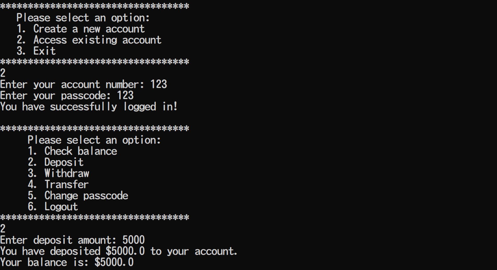
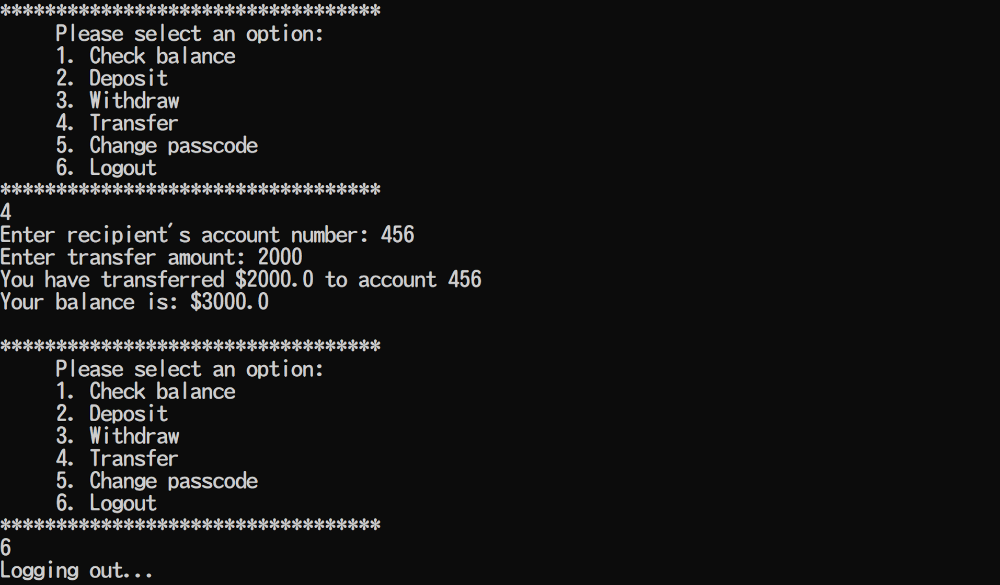

# ATM-Simulator 💳

This was my first side project, created in March 2023.

A command-line-based ATM simulator that offers an intuitive interface for basic banking operations.

## ATM-Simulator Interface Demos

Below are demonstrations of the ATM-Simulator in action:

### Deposit Function

Here's an example of how the deposit feature works:

### Transfer Function

This screenshot showcases the process of transferring money to another account:

## Quick Start ⚡

Before diving into all features, you can quickly test the simulator using the following default accounts:

- **Default Accounts**:
   - Account Number: 123, Passcode: 123
   - Account Number: 456, Passcode: 456

## Requirement 🔧

- **Java Version**: Ensure you have Java 14 or later installed. This project uses the enhanced `switch` expression syntax introduced in Java 14 (`switch -> { }`).

## Features 🚀

- **Account Management**:
   - Create a new account with a unique account number.
   - Access and manage an existing account.
   - Change the passcode of an account.

- **Banking Operations**:
   - View account balance.
   - Deposit money into an account.
   - Withdraw money from an account.
   - Transfer money to another account.

- **Error Handling**:
   - Handles non-numeric inputs using `InputMismatchException`.
   - Limits the number of invalid inputs to prevent misuse (with a cooldown period after multiple invalid attempts using `Thread.sleep()`)
   - Ensures users cannot transfer money to their own account.
   
- **Intuitive Interface**:
   - Intuitive menu-driven command-line interface.
   - Clear messages and prompts to guide users through operations.
   
## How to Run 🏃

There are many ways you can run the ATM-Simulator. Here are two examples:

### Using an Integrated Development Environment (IDE)

1. **Open Your IDE**: Launch your preferred Java IDE, such as Eclipse, IntelliJ IDEA, or Visual Studio Code.

2. **Open File**: Locate the `ATMSimulator.java` file you saved and open it in your IDE.

3. **Compile and Run**: Build and run the project using the IDE's built-in compiler and runner tools.

### Using the Command Prompt (cmd)

1. **Open Command Prompt**: Press `Win + R`, type `cmd`, and press Enter to open the command prompt.

2. **Navigate to Project Folder**: Use the `cd` command to navigate to the folder where your ATM-Simulator project files are located. For example:\
`cd path\to\your\project\folder`

3. **Compile Java File**: Compile the Java source code using the following command:\
`javac ATMSimulator.java`

4. **Run the Program**: Once compiled, run the program with the following command:\
`java ATMSimulator`